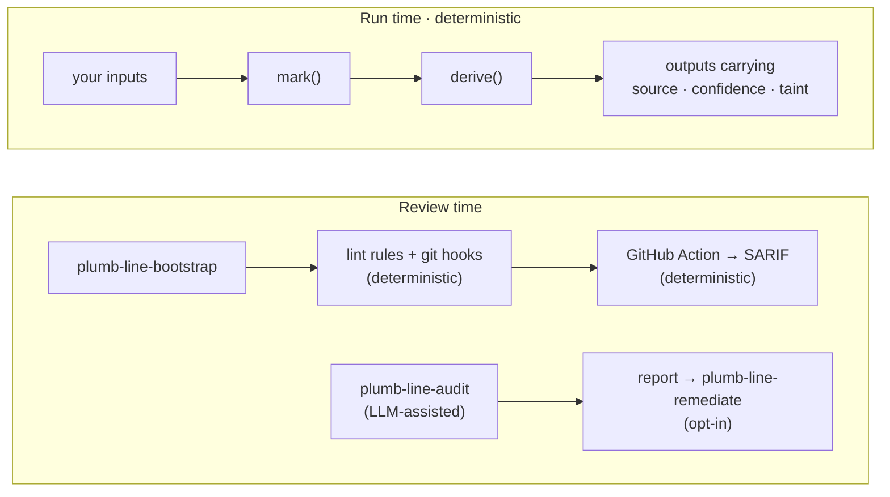

<h1 align="center">
  <picture>
    <source media="(prefers-color-scheme: dark)" srcset="docs/logo-dark.svg">
    
  </picture>
  &nbsp;plumb-line
</h1>

<p align="center"><b>Values that remember where they came from, and review tooling that detects when they don't.</b></p>

<p align="center">
<a href="https://www.npmjs.com/package/plumb-line-provenance"></a>
<a href="https://pypi.org/project/plumb-line-provenance/"></a>
<a href="https://github.com/slopstopper/plumb-line/actions/workflows/ci.yml"></a>
<a href="LICENSE"></a>
</p>

Every value in a program came from somewhere: a database, an API call, a test fixture, a default, a guess. Once it is sitting in a variable they all look the same, and the code that uses it cannot tell a measured number from a stubbed one. That is how a stubbed service answers "success" and the tests go green, how a guessed field flows into a report, and how a fallback meant for local development ends up shipping. Nothing fails loudly. The final number just looks as solid as everything around it.

plumb-line is a small library for JavaScript and Python that labels each value with where it came from (`real`, `mock`, `inferred`, `fallback`) and how much to trust it (`high` down to `none`), and keeps those labels attached as the value is combined with others. If a result was built from a mock or a guess, the result says so, and no later step can quietly upgrade it. Around the library, a set of review-time tools (Claude Code skills, lint rules and a GitHub Action) check a codebase for places where that honesty got lost.

One rule sits underneath all of it: combining values can keep or lower their trust level, never raise it ([the combination law](primitives/SPEC.md#3-the-combination-law)).

```js
const base  = mark(1000, { source: "real", confidence: "high" });
const rate  = mark(1.25, { source: "mock", confidence: "low" });
const total = derive([base, rate], (a, r) => a * r);

total.derivedFromMock; // true   inherited from rate, and impossible to clear
total.confidence;      // 'low'  only as certain as the weakest input
```

`mark` puts the labels on a value. `derive` runs your own function on labelled values and carries the labels through, keeping the weakest. The library never does the arithmetic and never changes a value; it only keeps the labels honest.

## Install

**As a Claude Code plugin.** The repository is its own marketplace:

```
/plugin marketplace add slopstopper/plumb-line
/plugin install plumb-line@plumb-line
```

Then run `plumb-line-adopt`. It looks at your repository and tells you which parts of plumb-line fit and what to run first. Updates arrive through `/plugin`.

**The library**, with or without the plugin:

```bash
npm install plumb-line-provenance      # JavaScript
pip install plumb-line-provenance      # Python
```

Zero dependencies. You can also copy `primitives/js/` or `primitives/python/` straight into your project.

**In CI.** Add the [GitHub Action](ACTION.md). On every pull request it runs the checks your `.plumb-line/enforcement.json` manifest names and writes one SARIF log, with no agent involved. Write that manifest by hand — the shape is in [ACTION.md](ACTION.md); having `plumb-line-bootstrap` write it is planned, not yet proven. Uploading the log to GitHub's code-scanning tab is wired (a sha-pinned `upload-sarif` step), but this repo's own CI uploads nothing, so ingestion is unobserved until an adopter reports it.

**Not using Claude?** [portable/README.md](portable/README.md) is the entry point without the plugin.

## A real incident, reconstructed

A documented failure, boiled down to a few lines ([the demo](examples/incident-toolserver/)): a server checks five tools and reports on their health, and three of the five are stubs that always answer "success". The first run is the program as written. The second is the same program with plumb-line's labels on its values.

```text
$ node broken/toolserver.mjs
  hash_text          success
  spawn_worker       success
  ...
system health: operational (5/5 tools succeeded)

$ node instrumented/toolserver.mjs
  hash_text          success  [source: real]
  spawn_worker       success  [source: mock]
  ...
system health: operational (5/5 tools succeeded)

report provenance:
  derivedFromMock: true
  confidence: none
  weakestSource: mock
  mock inputs: 3/5 (computed from lineage, not estimated)

attempted launder (derive with source: "real"):
  laundering: clean source 'real' but derivedFromMock is true
```

Same code, same "operational". The second version knows that three of its five results came from stubs, and when the code tries to relabel the report as real, the library refuses. That is the whole idea: a mocked result cannot be laundered into a real one.

It is the first of three documented incidents reconstructed in this repository, from three different fields:

| Field | What happened | What forgot where it came from | |
| --- | --- | --- | --- |
| Software | a server reported success for dead tools | stub payloads shaped like real results | [postmortem](docs/postmortems/mock-toolserver.md) |
| Aviation | a plane thought its passengers were children (AAIB, 2020) | a category guessed from an honorific | [postmortem](docs/postmortems/loadsheet.md) |
| Research | a retraction that started as a sign flip (five papers) | the output of an unversioned script | [postmortem](docs/postmortems/signflip.md) |

Different fields, same pattern: information lost its status somewhere in the system, and a downstream claim was treated as stronger than its evidence. None of the reconstructions claims plumb-line would have prevented the incident; each shows where the lost status would have been visible.

## You probably want this if

- **AI agents write or modify your code.** An agent that stubs a dependency to get a test green cannot tell you, weeks later, that the dashboard rests on that stub.
- **Mocks, fixtures, fallbacks, inferred or synthetic values** sit anywhere between an input and an output.
- **Your outputs are claims**: a figure in a paper, a risk score, a forecast, a "safe to proceed".
- **You need to know what evidence supports a result**, as well as what the result is.

Common in research and scientific code, data and ML pipelines, agent-built systems, and inherited codebases. If your app reads a trusted database and shows what it finds, you probably don't need the run-time layer; the [fit map](reference/fit-map.md) says so plainly.

## How it fits together



**Run time** is the library: labels travel with values inside your own code. **Review time** looks at a repository or a pull request for places where a mock was treated as real, a guess as a fact, or a claim has nothing behind it. The lint rules, hooks and the Action are deterministic; `plumb-line-audit` is LLM-assisted and writes a findings report, which `plumb-line-remediate` applies only if you ask. `adopt` and `method` route you in and teach the ideas. Use either layer on its own, or both.

## What is deterministic, and what is not

The library, the lint rules, the hooks and the Action are deterministic: the same inputs always give the same result. A [conformance suite](primitives/conformance/) holds the JavaScript and Python versions to identical behaviour, and the [validation results](docs/validation-results.md) show every planted violation caught with no false positives.

[](https://github.com/slopstopper/plumb-line/blob/main/primitives/SPEC.md)

That badge is earned, not decorative: `node primitives/conformance/report.mjs` passes every case in the suite against the current envelope schema. Any project that enforces provenance with plumb-line, or ships its own conformant implementation, can generate and carry the same badge ([how](primitives/conformance/README.md#the-badge)).

The audit and remediate skills use an LLM, so plumb-line measures them instead of trusting them. Before any release that changes them, independent auditors run them blind against test repositories with violations planted and the answers removed; a missed violation blocks the release unless a maintainer waives it in writing ([the harness](docs/release-harness.md)). For v0.11.0, all six auditors found every planted violation and invented none, and both remediators refused to launder a mock under gate pressure ([the record](docs/validation-results.md#v0110-release-harness-record--2026-09-15-pre-tag)).

## It audits itself

Before each of those releases, plumb-line also runs its own audit skill over its own code and publishes what it found in the [dogfooding report](docs/dogfood.md). For v0.11.0: nine findings, all places where the project's own docs promised more than its tooling enforced; six fixed on the spot, three tracked as issues ([#398](https://github.com/slopstopper/plumb-line/issues/398), [#399](https://github.com/slopstopper/plumb-line/issues/399), [#400](https://github.com/slopstopper/plumb-line/issues/400)). The same run caught its own operator error: the first six auditors had been dispatched through a stale plugin install, and the format checker failed all six before any were scored. "The auditor found no problem" is never treated as proof that no problem exists.

## What plumb-line does not claim

- It does not prove that a value marked `real` is true. It records what the code claimed and stops that claim from being upgraded later.
- It does not stop a source from lying, or a developer from marking a mock as real. The lint rules make that visible; they cannot make it impossible.
- It does not make the LLM auditor infallible. Its misses and false positives are measured and recorded.
- It does not yet carry provenance across every boundary. The guarantee holds inside one process; surviving serialization, files and HTTP is [planned](#where-this-is-going).
- Python envelopes are tamper-evident: an edit can be detected but not prevented ([threat model](docs/threat-model.md)).

The target is narrow: make it hard for software to turn uncertain information into something that looks certain without anyone noticing.

## Status

Current on `main`: the library with JS/Python parity, published to npm and PyPI as `plumb-line-provenance`; the golden-baseline library and CLI; the five skills; enforcement adapters for JavaScript and Python; and the GitHub Action with SARIF output. The envelope and the combination law are pinned by a versioned [specification](primitives/SPEC.md) (schema version 2) and the conformance suite. Everything beyond that is **planned**; the [roadmap](ROADMAP.md) is the index and the [changelog](CHANGELOG.md) has the per-release detail.

## Where this is going

- **Deepen the promise:** run-time primitives that refuse and explain. (The adoption ratchet for legacy codebases — no *new* untagged outputs — is current on `main`, unreleased; see [ACTION.md](ACTION.md#ratchet-mode).)
- **Provenance across boundaries:** envelopes that survive serialization, files and HTTP.
- **Agent epistemic state:** the audit skill's coverage map and honest denominator, generalized into a spec any agent can adopt.

**The goal.** AI-assisted software is getting good at producing convincing answers and convincing artifacts. The harder problem is knowing what those outputs are entitled to claim. plumb-line is an attempt to put that boundary into software, so that uncertainty survives computation and a result does not become more trustworthy just because a program processed it.

## Reference

- [`primitives/README.md`](primitives/README.md): the model, the law, the envelope fields, the runtime checker, the baseline API, worked examples
- [`primitives/SPEC.md`](primitives/SPEC.md): envelope schema, version 2 · [`primitives/conformance/`](primitives/conformance/): the case table both languages are held to
- [`ACTION.md`](ACTION.md): the GitHub Action, its manifest and SARIF output · [`adapters/`](adapters/): the lint rules and hooks bootstrap installs
- Ingestion adapters, optional extras: HTTP ([ADR-0012](docs/adr/0012-ecosystem-adapters-optional-deps-and-mapping.md)) and dataframe ([ADR-0013](docs/adr/0013-dataframe-adapters-explicit-combinators.md))
- [`reference/portable-principles.md`](reference/portable-principles.md): the nine principles · [`reference/fit-map.md`](reference/fit-map.md): does the library fit your codebase
- [`docs/adr/`](docs/adr/): architecture decisions, append-only

## Security

<a href="https://scorecard.dev/viewer/?uri=github.com/slopstopper/plumb-line"></a>
<a href="https://www.bestpractices.dev/projects/13453"></a>
<a href="https://socket.dev/npm/package/plumb-line-provenance"></a>

The provenance envelope is a trust claim, so the [threat model](docs/threat-model.md) states what is defended (taint cannot be laundered through the public API) and what is not. To report a vulnerability, see [`SECURITY.md`](SECURITY.md).

## Contributing & governance

Contributions are welcome; see [CONTRIBUTING.md](CONTRIBUTING.md) for how to open an issue or PR, and [GOVERNANCE.md](GOVERNANCE.md) for how the project is run. Participation is governed by the [Code of Conduct](CODE_OF_CONDUCT.md).

## Feedback

Tried it on a real codebase? Open a [feedback issue](https://github.com/slopstopper/plumb-line/issues/new?template=feedback.yml), or use the [private form](https://slopstopper.github.io/plumb-line/feedback.html) for a confidential codebase. Raw output and one concrete "it caught something we'd otherwise have shipped" beat polished prose.

The full name is **plumb-line provenance**. Unrelated projects called "plumbline" exist. This is the hyphenated one.

## License

Apache-2.0 — see [LICENSE](LICENSE) and [NOTICE](NOTICE).
