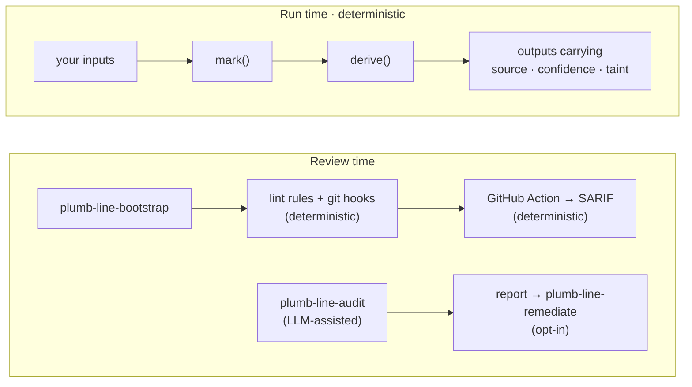

<h1 align="center">
  <picture>
    <source media="(prefers-color-scheme: dark)" srcset="docs/logo-dark.svg">
    
  </picture>
  &nbsp;plumb-line
</h1>

<p align="center"><b>Values that remember where they came from, and review tooling that notices when they don't.</b></p>

<p align="center">
<a href="https://www.npmjs.com/package/plumb-line-provenance"></a>
<a href="https://pypi.org/project/plumb-line-provenance/"></a>
<a href="https://github.com/slopstopper/plumb-line/actions/workflows/ci.yml"></a>
<a href="LICENSE"></a>
</p>

Software can calculate something correctly and still be wrong about what it knows. A stubbed service answers "success" and the tests go green. A guessed value flows into a report. A fallback meant for local development ships. Nothing fails loudly; the final number just looks as solid as everything around it.

plumb-line attaches to every value a record of where it came from and how much to trust it, and that record travels with the value as it is combined with others. A result built on a mock or a guess says so, and nothing downstream can quietly upgrade it. One rule sits underneath all of it: combining values can keep or lower their trust level, never raise it ([the combination law](primitives/SPEC.md#3-the-combination-law)).

```js
const base  = mark(1000, { source: "real", confidence: "high" });
const rate  = mark(1.25, { source: "mock", confidence: "low" });
const total = derive([base, rate], (a, r) => a * r);

total.derivedFromMock; // true   inherited from rate, and impossible to clear
total.confidence;      // 'low'  only as certain as the weakest input
```

`mark` labels a value with where it came from and how much to trust it. `derive` runs your own function and carries the labels through, keeping the weakest. The library never does the arithmetic and never changes a value; it only keeps the labels honest.

## Install

**As a Claude Code plugin.** The repository is its own marketplace:

```
/plugin marketplace add slopstopper/plumb-line
/plugin install plumb-line@plumb-line
```

Then run `plumb-line-adopt`. It looks at your repository and tells you which parts of plumb-line fit and what to run first. Updates arrive through `/plugin`.

**The library**, with or without the plugin:

```bash
npm install plumb-line-provenance      # JavaScript
pip install plumb-line-provenance      # Python
```

Zero dependencies. You can also copy `primitives/js/` or `primitives/python/` straight into your project.

**In CI.** Add the [GitHub Action](ACTION.md) once bootstrap has set up enforcement. Every pull request then gets the same checks, with results in GitHub's code-scanning tab and no agent involved.

**Not using Claude?** [portable/README.md](portable/README.md) is the entry point without the plugin.

## Same number, different claim

A tool server checks five tools and reports on their health. Three of the five are stubs that always answer "success" ([the demo](examples/incident-toolserver/)):

```text
$ node broken/toolserver.mjs
  hash_text          success
  spawn_worker       success
  ...
system health: operational (5/5 tools succeeded)

$ node instrumented/toolserver.mjs
  hash_text          success  [source: real]
  spawn_worker       success  [source: mock]
  ...
system health: operational (5/5 tools succeeded)

report provenance:
  derivedFromMock: true
  weakestSource: mock
  mock inputs: 3/5 (computed from lineage, not estimated)

attempted launder (derive with source: "real"):
  laundering: clean source 'real' but derivedFromMock is true
```

Same code, same "operational". The second version knows that three of its five results came from stubs, and when the code tries to relabel the report as real, the library refuses. That is the whole idea: a mocked result cannot be laundered into a real one.

This has happened for real. Three documented incidents, each with a runnable reconstruction in this repository:

- **Software:** [a server reported success for dead tools](docs/postmortems/mock-toolserver.md). Stub tools returned success-shaped payloads, and nobody could say how much of the system was fake.
- **Aviation:** [a plane thought its passengers were children](docs/postmortems/loadsheet.md). A category guessed from an honorific went into a takeoff-weight calculation as if it were known (AAIB, 2020).
- **Research:** [a retraction that started as a sign flip](docs/postmortems/signflip.md). An unversioned script inverted published protein structures; five papers were retracted.

Different fields, same pattern: information lost its status somewhere in the system, and a downstream claim was treated as stronger than its evidence. None of the reconstructions claims plumb-line would have prevented the incident; each shows where the lost status would have been visible.

## You probably want this if

- **AI agents write or modify your code.** An agent that stubs a dependency to get a test green cannot tell you, weeks later, that the dashboard rests on that stub.
- **Mocks, fixtures, fallbacks, inferred or synthetic values** sit anywhere between an input and an output.
- **Your outputs are claims**: a figure in a paper, a risk score, a forecast, a "safe to proceed".
- **You need to know what evidence supports a result**, as well as what the result is.

Common in research and scientific code, data and ML pipelines, agent-built systems, and inherited codebases. If your app reads a trusted database and shows what it finds, you probably don't need the run-time layer; the [fit map](reference/fit-map.md) says so plainly.

## How it fits together



**Run time** is the library above: provenance travels with values inside your own code. **Review time** looks at a repository or a pull request for places where uncertainty got laundered: a mock treated as real, a guess presented as a fact, a claim with nothing behind it. Some of those checks are deterministic: lint rules and git hooks that `plumb-line-bootstrap` installs, and the GitHub Action that runs them in CI. One is LLM-assisted: `plumb-line-audit` reads the code and writes a findings report, and `plumb-line-remediate` applies the findings if you ask it to. Two more skills, `adopt` and `method`, route you in and teach the ideas. Use either layer on its own, or both.

## What is deterministic, and what is not

The library and its rules are deterministic: the same inputs always produce the same labels, and a [conformance suite](primitives/conformance/) checks that the JavaScript and Python versions behave identically, case by case. The lint rules, hooks and the Action are deterministic too: a rule either fires or it does not, and the [validation results](docs/validation-results.md) show every planted violation caught with no false positives.

The audit and remediate skills use an LLM. They are useful reviewers and not authorities, so plumb-line measures them instead of trusting them. Before any release that changes them, they are run blind against test repositories with known violations planted in them and the answers removed. Independent auditors run separately, and a missed violation blocks the release unless a maintainer waives it in writing ([the harness](docs/release-harness.md)). False positives are kept on record too.

For the v0.10.0 release ([the record](docs/validation-results.md#v0100-release-harness-record--2026-08-19-pre-tag)) that meant six auditors, two per test repository with violations and one per clean one, each given only the skill's instructions, the principles, and a repository with the answers stripped. All six passed: every planted violation found, nothing invented in the clean repositories. The record also keeps what went wrong: one of the six reports failed the formatting check, and had said it could not run that check rather than claiming a clean result.

## It audits itself

Before each of those releases, plumb-line also runs its own audit skill over its own code and publishes what it found in the [dogfooding report](docs/dogfood.md). For v0.10.0 that was six findings, all of them places where the project's own docs promised more than its tooling enforced; four were fixed on the spot and two became tracked issues ([#316](https://github.com/slopstopper/plumb-line/issues/316), [#317](https://github.com/slopstopper/plumb-line/issues/317)). False positives stay in the record. "The auditor found no problem" is never treated as proof that no problem exists.

## What plumb-line does not claim

- It does not prove that a value marked `real` is true. It records what the code claimed and stops that claim from being upgraded later.
- It does not stop a source from lying, or a developer from marking a mock as real. The lint rules make bypasses visible; they cannot make them impossible.
- It does not make the LLM auditor infallible. Misses and false positives are measured and recorded, and the deterministic checks stand on their own.
- It does not yet carry provenance across every boundary. The guarantee holds inside one process; surviving serialization, files and HTTP is [planned](#where-this-is-going). The HTTP and dataframe adapters tag data on the way in and carry the labels through the operations they provide; nothing crosses the wire yet.
- Python envelopes are tamper-evident: an edit can be detected but not prevented ([threat model](docs/threat-model.md)).

The target is narrow: make it hard for software to turn uncertain information into something that looks certain without anyone noticing.

## Status

Current on `main`: the run-time library with JS/Python parity, published to npm and PyPI as `plumb-line-provenance`; the golden-baseline library and CLI (Principle 9); the five skills; enforcement adapters for JavaScript and Python; and the GitHub Action with SARIF output. The envelope and the combination law are pinned by a versioned [specification](primitives/SPEC.md) (schema version 2) and the conformance suite. The baseline and the Action are on `main` ahead of the v0.11.0 tag.

Everything beyond that is **planned**. The [roadmap](ROADMAP.md) is the index, the open issues are that roadmap in public ([#311](https://github.com/slopstopper/plumb-line/issues/311)), and the [changelog](CHANGELOG.md) has the per-release detail.

## Where this is going

- **Deepen the promise:** an adoption ratchet for legacy codebases (no *new* untagged outputs), and run-time primitives that refuse and explain.
- **Provenance across boundaries:** envelopes that survive serialization, files and HTTP.
- **Agent epistemic state:** the audit skill's coverage map and honest denominator, generalized into a spec any agent can adopt.

**The goal.** AI-assisted software is getting good at producing convincing answers and convincing artifacts. The harder problem is knowing what those outputs are entitled to claim. plumb-line is an attempt to put that boundary into software, so that uncertainty survives computation and a result does not become more trustworthy just because a program processed it.

## Reference

- [`primitives/README.md`](primitives/README.md): the model, the law, the envelope fields, the runtime checker, the baseline API, worked examples
- [`primitives/SPEC.md`](primitives/SPEC.md): envelope schema, version 2 · [`primitives/conformance/`](primitives/conformance/): the case table both languages are held to
- [`ACTION.md`](ACTION.md): the GitHub Action, its manifest and SARIF output · [`adapters/`](adapters/): the lint rules and hooks bootstrap installs
- Ingestion adapters, optional extras: HTTP ([ADR-0012](docs/adr/0012-ecosystem-adapters-optional-deps-and-mapping.md)) and dataframe ([ADR-0013](docs/adr/0013-dataframe-adapters-explicit-combinators.md))
- [`reference/portable-principles.md`](reference/portable-principles.md): the nine principles · [`reference/fit-map.md`](reference/fit-map.md): does the library fit your codebase
- [`docs/adr/`](docs/adr/): architecture decisions, append-only

| Path | What's there |
| --- | --- |
| `primitives/` | Run-time library (JS + Python), `SPEC.md`, conformance suite |
| `skills/` | The five Claude Code skills |
| `adapters/` | ESLint / import-linter rules, git hooks, the SARIF assembler |
| `reference/` | Portable principles, fit map, ruleset template |
| `examples/` | Clean / broken fixtures and the three incident demos |
| `docs/adr/` | Architecture decision records |

## Security

<a href="https://scorecard.dev/viewer/?uri=github.com/slopstopper/plumb-line"></a>
<a href="https://www.bestpractices.dev/projects/13453"></a>
<a href="https://socket.dev/npm/package/plumb-line-provenance"></a>

The provenance envelope is a trust claim, so the [threat model](docs/threat-model.md) states what is defended (taint cannot be laundered through the public API) and what is not. To report a vulnerability, see [`SECURITY.md`](SECURITY.md).

## Contributing & governance

Contributions are welcome; see [CONTRIBUTING.md](CONTRIBUTING.md) for how to open an issue or PR, and [GOVERNANCE.md](GOVERNANCE.md) for how the project is run. Participation is governed by the [Code of Conduct](CODE_OF_CONDUCT.md).

## Feedback

Tried it on a real codebase? Open a [feedback issue](https://github.com/slopstopper/plumb-line/issues/new?template=feedback.yml), or use the [private form](https://slopstopper.github.io/plumb-line/feedback.html) for a confidential codebase. Raw output and one concrete "it caught something we'd otherwise have shipped" beat polished prose.

The full name is **plumb-line provenance**. Unrelated projects called "plumbline" exist. This is the hyphenated one.

## License

Apache-2.0 — see [LICENSE](LICENSE) and [NOTICE](NOTICE).
