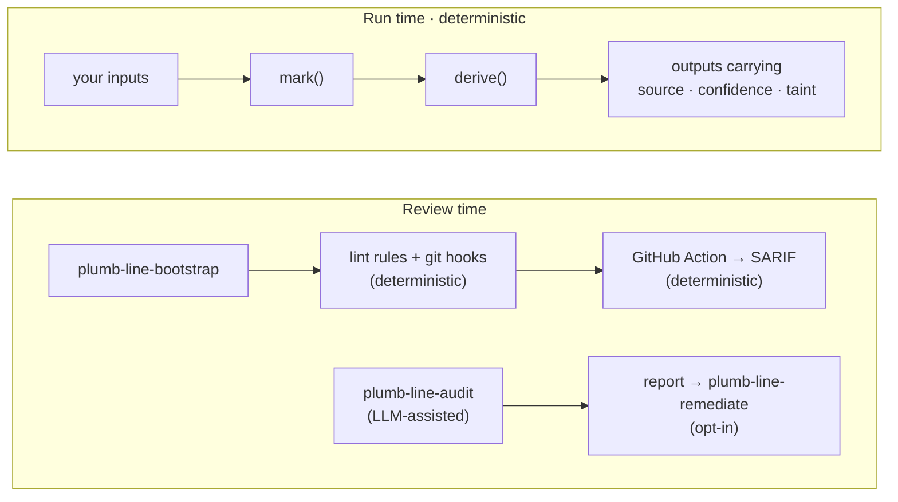

<h1 align="center">
  <picture>
    <source media="(prefers-color-scheme: dark)" srcset="docs/logo-dark.svg">
    
  </picture>
  &nbsp;plumb-line
</h1>

<p align="center"><b>Values that remember where they came from, and review tooling that notices when they don't.</b></p>

<p align="center">
<a href="https://www.npmjs.com/package/plumb-line-provenance"></a>
<a href="https://pypi.org/project/plumb-line-provenance/"></a>
<a href="https://github.com/slopstopper/plumb-line/actions/workflows/ci.yml"></a>
<a href="LICENSE"></a>
</p>

Software can calculate something correctly and still be wrong about what it knows. A stubbed service answers "success" and the tests go green. A guessed value flows into a report. A fallback meant for local development ships. Nothing fails loudly; the final number just looks as solid as everything around it.

plumb-line attaches to each value a record of where it came from and how far to trust it, and keeps that record attached as values combine. A result built on a mock or a guess says so, and nothing can clear that mark on the way through. The rule is small: combining values can keep or lower their standing, never raise it ([the combination law](primitives/SPEC.md#3-the-combination-law)).

```js
const base  = mark(1000, { source: "real", confidence: "high" });
const rate  = mark(1.25, { source: "mock", confidence: "low" });
const total = derive([base, rate], (a, r) => a * r);

total.derivedFromMock; // true   inherited from rate, and impossible to clear
total.confidence;      // 'low'  only as certain as the weakest input
```

`mark` labels a value. `derive` runs your function and keeps the weakest label. The library never touches the arithmetic; it only keeps the labels honest.

## Get started

As a Claude Code plugin, the repository is its own marketplace:

```
/plugin marketplace add slopstopper/plumb-line
/plugin install plumb-line@plumb-line
```

Then run `plumb-line-adopt`; it looks at your repository and says which parts fit and what to run first. The library is independent of the plugin: `npm install plumb-line-provenance` or `pip install plumb-line-provenance`, zero dependencies. For CI, add the [GitHub Action](ACTION.md) once bootstrap has installed enforcement, and every pull request gets the same checks with SARIF for code scanning, no agent involved. Not using Claude? [portable/README.md](portable/README.md) is the entry point that skips the plugin shell.

## Same number, different claim

A tool server reports on five tools. Three of them are stubs ([the demo](examples/incident-toolserver/)):

```text
$ node broken/toolserver.mjs
  hash_text          success
  spawn_worker       success
  ...
system health: operational (5/5 tools succeeded)

$ node instrumented/toolserver.mjs
  hash_text          success  [source: real]
  spawn_worker       success  [source: mock]
  ...
system health: operational (5/5 tools succeeded)

report provenance:
  derivedFromMock: true
  weakestSource: mock
  mock inputs: 3/5 (computed from lineage, not estimated)

attempted launder (derive with source: "real"):
  laundering: clean source 'real' but derivedFromMock is true
```

Same code path, same "operational". One version knows that three fifths of it is fake, and refuses to be relabelled real. That shape has happened for real, three times, in three domains: [a server that reported success for dead tools](docs/postmortems/mock-toolserver.md), [a plane that thought its passengers were children](docs/postmortems/loadsheet.md) (AAIB, 2020), and [a retraction that started as a sign flip](docs/postmortems/signflip.md) (five papers). Each has a runnable reconstruction. None claims plumb-line would have prevented the incident; each shows where the lost status would have been visible.

## You probably want this if

- **AI agents write or modify your code.** An agent that stubs a dependency to get a test green cannot tell you, weeks later, that the dashboard rests on that stub.
- **Mocks, fixtures, fallbacks, inferred or synthetic values** sit anywhere between an input and an output.
- **Your outputs are claims**: a figure in a paper, a risk score, a forecast, a "safe to proceed".
- **You need to know what evidence supports a result**, as well as what the result is.

Common in research and scientific code, data and ML pipelines, agent-built systems, and inherited codebases. If your app reads a trusted database and shows what it finds, you probably don't need the run-time layer; the [fit map](reference/fit-map.md) says so plainly.

## How it fits together



**Run time** is the library: provenance travels with values through your own code. **Review time** reads a repository or a diff for uncertainty that got laundered: deterministic lint rules, hooks and the Action, plus the LLM-assisted audit. Five Claude Code skills carry it (`adopt`, `method`, `bootstrap`, `audit`, `remediate`); three never write to your code, two write only when you say yes. Use either layer alone, or both.

## What is deterministic, and what is not

The library, its propagation rules, the lint rules and the Action are deterministic. A [conformance suite](primitives/conformance/) holds JavaScript and Python to identical behaviour, and the [validation results](docs/validation-results.md) record every planted violation caught with no false positives.

The audit and remediate skills use an LLM, so plumb-line treats them as probabilistic components whose miss rate has to be measured. Before a release that touches them, blind validation runs on fixtures with planted violations: answer keys withheld, independent auditors, and a miss blocks the release unless waived in writing ([the harness](docs/release-harness.md)). False positives stay in the record.

## Proven before release

What that looks like in practice, from the [v0.10.0 record](docs/validation-results.md#v0100-release-harness-record--2026-08-19-pre-tag): six read-only auditors, two independent per broken fixture, answer keys deleted and the strip self-verified.

| Run | Planted set | Result |
| --- | --- | --- |
| js-broken A | P2 rates.js, P5 pricing.js, P3 gateway.js — all confirmed | PASS |
| js-broken B | same three confirmed | PASS |
| py-broken A | P2 schema.py, P5 aggregate.py, P8 source.py — all confirmed | PASS |
| py-broken B | same three confirmed | PASS |
| js-clean | 0 confirmed violations | PASS |
| py-clean | 0 confirmed violations | PASS |

The same record keeps what went wrong: one of the six reports failed the format check, and had declared `format-validation: not run` instead of asserting a clean verdict, which is the earned-verdict rule that release had just added, seen working. Misses and false positives from earlier releases sit in the same file.

## It audits itself

Before each such release, plumb-line runs its own audit over its own code and records what it found in the [dogfooding report](docs/dogfood.md). From the v0.10.0 section: 6 findings, 0 violations, 6 needs-review, all of them gaps between what this release's own prose promised and what its tooling enforced. Four fixed in place, two deferred to tracked issues ([#316](https://github.com/slopstopper/plumb-line/issues/316), [#317](https://github.com/slopstopper/plumb-line/issues/317)). One of them:

| Path | Issue | Principle | Resolution |
| --- | --- | --- | --- |
| `scripts/check_content_language.py` | the language flagger matched per physical line, so a banned construction split across a wrap escaped, and the ban's declaration did not state the limit | P6 — Maturity vocabulary | disclosure fixed in place; scanner improvement deferred → #316, since closed |

Findings are fixed where the fix is right and otherwise become issues; false positives stay in the record. "The auditor found no problem" is never treated as proof that no problem exists.

## What plumb-line does not claim

- It does not prove that a value marked `real` is true. It records what the code claimed and keeps that claim from being upgraded.
- It does not stop a source from lying, or a developer from marking a mock as real. The lint rules make bypasses visible; they cannot make them impossible.
- It does not make the LLM auditor infallible. Misses and false positives are measured and recorded, and the deterministic checks stand apart from it.
- It does not yet carry provenance across every boundary. The guarantee holds inside one process; serialization, files and HTTP are [planned](#where-this-is-going).
- Python envelopes are tamper-evident only; the [threat model](docs/threat-model.md) says exactly what is defended.

The target is narrow: make it hard for software to turn uncertain information into something that looks certain without anyone noticing.

## Status

Current on `main`: the run-time primitive with JS/Python parity, published to npm and PyPI as `plumb-line-provenance`; the golden-baseline library and CLI (Principle 9); the five skills; enforcement adapters for JavaScript and Python; and the GitHub Action with SARIF output. The envelope and the combination law are pinned by a versioned [specification](primitives/SPEC.md) (schema version 2) and the conformance suite. The baseline and the Action are on `main` ahead of the v0.11.0 tag.

Everything beyond that is **planned**. The [roadmap](ROADMAP.md) is the index, the open issues are that roadmap in public ([#311](https://github.com/slopstopper/plumb-line/issues/311)), and the [changelog](CHANGELOG.md) has the per-release detail.

## Where this is going

- **Deepen the promise:** an adoption ratchet for legacy codebases (no *new* untagged outputs), and run-time primitives that refuse and explain.
- **Provenance across boundaries:** envelopes that survive serialization, files and HTTP.
- **Agent epistemic state:** the audit skill's coverage map and honest denominator, generalized into a spec any agent can adopt.

**The goal.** AI-assisted software is getting good at producing convincing answers and convincing artifacts. The harder problem is knowing what those outputs are entitled to claim. plumb-line is an attempt to put that boundary into software, so that uncertainty survives computation and a result does not become more trustworthy just because a program processed it.

## Reference

- [`primitives/README.md`](primitives/README.md): the model, the law, the envelope fields, the runtime checker, the baseline API, worked examples
- [`primitives/SPEC.md`](primitives/SPEC.md): envelope schema, version 2 · [`primitives/conformance/`](primitives/conformance/): the case table both languages are held to
- [`ACTION.md`](ACTION.md): the GitHub Action, its manifest and SARIF output · [`adapters/`](adapters/): the lint rules and hooks bootstrap installs
- Ingestion adapters, optional extras: HTTP ([ADR-0012](docs/adr/0012-ecosystem-adapters-optional-deps-and-mapping.md)) and dataframe ([ADR-0013](docs/adr/0013-dataframe-adapters-explicit-combinators.md))
- [`reference/portable-principles.md`](reference/portable-principles.md): the nine principles · [`reference/fit-map.md`](reference/fit-map.md): does the library fit your codebase
- [`docs/adr/`](docs/adr/): architecture decisions, append-only

| Path | What's there |
| --- | --- |
| `primitives/` | Run-time library (JS + Python), `SPEC.md`, conformance suite |
| `skills/` | The five Claude Code skills |
| `adapters/` | ESLint / import-linter rules, git hooks, the SARIF assembler |
| `reference/` | Portable principles, fit map, ruleset template |
| `examples/` | Clean / broken fixtures and the three incident demos |
| `docs/adr/` | Architecture decision records |

## Security

<a href="https://scorecard.dev/viewer/?uri=github.com/slopstopper/plumb-line"></a>
<a href="https://www.bestpractices.dev/projects/13453"></a>
<a href="https://socket.dev/npm/package/plumb-line-provenance"></a>

The provenance envelope is a trust claim, so the [threat model](docs/threat-model.md) states what is defended (taint cannot be laundered through the public API) and what is not. To report a vulnerability, see [`SECURITY.md`](SECURITY.md).

## Contributing & governance

Contributions are welcome; see [CONTRIBUTING.md](CONTRIBUTING.md) for how to open an issue or PR, and [GOVERNANCE.md](GOVERNANCE.md) for how the project is run. Participation is governed by the [Code of Conduct](CODE_OF_CONDUCT.md).

## Feedback

Tried it on a real codebase? Open a [feedback issue](https://github.com/slopstopper/plumb-line/issues/new?template=feedback.yml), or use the [private form](https://slopstopper.github.io/plumb-line/feedback.html) for a confidential codebase. Raw output and one concrete "it caught something we'd otherwise have shipped" beat polished prose.

The full name is **plumb-line provenance**. Unrelated projects called "plumbline" exist. This is the hyphenated one.

## License

Apache-2.0 — see [LICENSE](LICENSE) and [NOTICE](NOTICE).
