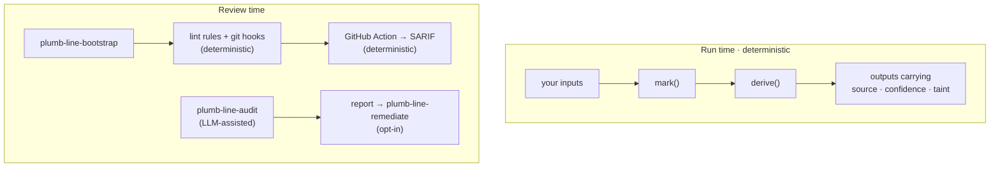

<h1 align="center">
  <picture>
    <source media="(prefers-color-scheme: dark)" srcset="docs/logo-dark.svg">
    
  </picture>
  &nbsp;plumb-line
</h1>

<p align="center"><b>Values that remember where they came from, and review tooling that notices when they don't.</b></p>

<p align="center">
<a href="https://www.npmjs.com/package/plumb-line-provenance"></a>
<a href="https://pypi.org/project/plumb-line-provenance/"></a>
<a href="https://github.com/slopstopper/plumb-line/actions/workflows/ci.yml"></a>
<a href="LICENSE"></a>
</p>

Software can calculate something correctly and still be wrong about what it knows. A stubbed service answers "success" and the tests go green. A guessed value flows into a report. A fallback meant for local development ships. Nothing fails loudly; the final number just looks as solid as everything around it.

plumb-line attaches to each value a record of where it came from and how far to trust it, and keeps that record attached as values combine. Combining values can keep or lower their standing, never raise it ([the combination law](primitives/SPEC.md#3-the-combination-law)):

```js
const base  = mark(1000, { source: "real", confidence: "high" });
const rate  = mark(1.25, { source: "mock", confidence: "low" });
const total = derive([base, rate], (a, r) => a * r);

total.derivedFromMock; // true   inherited from rate, and impossible to clear
total.confidence;      // 'low'  only as certain as the weakest input
```

`mark` labels a value. `derive` runs your function and keeps the weakest label. The library never touches the arithmetic; it only keeps the labels honest.

## Get started

| | |
| --- | --- |
| **Claude Code plugin** (five skills) | `/plugin marketplace add slopstopper/plumb-line` then `/plugin install plumb-line@plumb-line`, then run `plumb-line-adopt` |
| **Library** (JS + Python, zero dependencies) | `npm install plumb-line-provenance` · `pip install plumb-line-provenance` |
| **CI** | Add the [GitHub Action](ACTION.md) once bootstrap has installed enforcement: SARIF in code scanning, no agent needed |
| **Not using Claude?** | [portable/README.md](portable/README.md) skips the plugin shell |

## Same number, different claim

A ten-passenger load sheet where three categories are guessed from a title ([the demo](examples/incident-loadsheet/)). Same arithmetic, same total; one version knows what it is standing on.

**Without provenance** (`python3 examples/incident-loadsheet/broken/loadsheet.py`), the sheet is tidy and confident:

```text
  1A  Mr     adult  84 kg
  3A  Miss   child  35 kg
  ...
total takeoff mass: 693 kg
load sheet: complete
```

**With provenance** (`instrumented/loadsheet.py`), the same total carries what it rests on, and the attempt to issue it as fully confident is caught:

```text
  1A  Mr     84 kg  [real/medium — booking]
  3A  Miss   35 kg  [inferred/low — guessed from title]
  ...
total takeoff mass: 693 kg

load sheet provenance:
  confidence: low
  weakest_source: inferred
  inferred inputs: 3/10 (computed from lineage, not estimated)

attempted over-claim (derive with confidence: "high"):
  over-claiming: confidence 'high' exceeds weakest lineage confidence 'low'
```

That shape has happened for real. Three documented incidents, each reconstructed with a runnable demo:

| Incident | What forgot where it came from | |
| --- | --- | --- |
| A server reported success for dead tools | stub payloads shaped like real results | [postmortem](docs/postmortems/mock-toolserver.md) |
| A plane thought its passengers were children (AAIB, 2020) | a category guessed from an honorific | [postmortem](docs/postmortems/loadsheet.md) |
| A retraction that started as a sign flip (five papers) | the output of an unversioned script | [postmortem](docs/postmortems/signflip.md) |

None of the postmortems claims plumb-line would have prevented the incident. Each shows where the lost status would have been visible.

## You probably want this if

- **AI agents write or modify your code.** An agent that stubs a dependency to get a test green cannot tell you, weeks later, that the dashboard rests on that stub.
- **Mocks, fixtures, fallbacks, inferred or synthetic values** sit anywhere between an input and an output.
- **Your outputs are claims**: a figure in a paper, a risk score, a forecast, a "safe to proceed".
- **You need to know what evidence supports a result**, as well as what the result is.

Common in research and scientific code, data and ML pipelines, agent-built systems, and inherited codebases. If your app reads a trusted database and shows what it finds, you probably don't need the run-time layer; the [fit map](reference/fit-map.md) says so plainly.

## How it fits together



**Run time** is the library: provenance travels with values through your own code. **Review time** reads a repository or a diff for uncertainty that got laundered: deterministic lint rules, hooks and the Action, plus the LLM-assisted audit. Five Claude Code skills carry it (`adopt`, `method`, `bootstrap`, `audit`, `remediate`); three never write to your code, two write only when you say yes. Use either layer alone, or both.

## Deterministic, or LLM-assisted

| | What | How it is proven |
| --- | --- | --- |
| **Deterministic** | the library and its propagation rules; the lint rules, hooks and Action | a cross-language [conformance suite](primitives/conformance/) pins JS and Python to identical behaviour; planted-violation fixtures, [every one caught, no false positives](docs/validation-results.md) |
| **LLM-assisted** | the `audit` and `remediate` skills | treated as probabilistic components whose miss rate is measured: [blind validation](docs/release-harness.md) before each release that touches them, with planted violations, answer keys withheld and independent auditors; a miss blocks the release |

**It audits itself.** Before each such release, plumb-line runs its own audit over its own code and records the findings, false positives included, in the [dogfooding report](docs/dogfood.md). "The auditor found no problem" is never treated as proof that no problem exists.

## What it does, and does not

| plumb-line does | plumb-line does not |
| --- | --- |
| keep a value's origin and confidence attached as it combines | prove that a value marked `real` is true |
| refuse to let a mock or a guess become clean on the way through | stop a source from lying, or a developer from marking a mock as real |
| flag over-claims at run time (`auditMeta` / `audit_meta`) | make the LLM auditor infallible |
| check layer boundaries mechanically, in review and in CI | carry provenance across serialization or HTTP yet ([planned](ROADMAP.md)) |
| audit itself and keep the misses on record | make Python envelopes tamper-proof (they are tamper-evident; [threat model](docs/threat-model.md)) |

The target is narrow: make it hard for software to turn uncertain information into something that looks certain without anyone noticing.

<details>
<summary><b>Status and direction</b></summary>

**Current on `main`:** the run-time primitive with JS/Python parity, published to npm and PyPI as `plumb-line-provenance`; the golden-baseline library and CLI (Principle 9); the five skills; enforcement adapters for JavaScript and Python; and the GitHub Action with SARIF output. The envelope and the combination law are pinned by a versioned [specification](primitives/SPEC.md) (schema version 2) and the conformance suite. The baseline and the Action are on `main` ahead of the v0.11.0 tag.

Everything beyond that is **planned**. The [roadmap](ROADMAP.md) is the index, the open issues are that roadmap in public ([#311](https://github.com/slopstopper/plumb-line/issues/311)), and the [changelog](CHANGELOG.md) has the per-release detail.

- **Deepen the promise:** an adoption ratchet for legacy codebases (no *new* untagged outputs), and run-time primitives that refuse and explain.
- **Provenance across boundaries:** envelopes that survive serialization, files and HTTP.
- **Agent epistemic state:** the audit skill's coverage map and honest denominator, generalized into a spec any agent can adopt.

**The goal.** AI-assisted software is getting good at producing convincing answers and convincing artifacts. The harder problem is knowing what those outputs are entitled to claim. plumb-line is an attempt to put that boundary into software, so that uncertainty survives computation and a result does not become more trustworthy just because a program processed it.

</details>

<details>
<summary><b>Reference</b></summary>

- [`primitives/README.md`](primitives/README.md): the model, the law, the envelope fields, the runtime checker, the baseline API, worked examples
- [`primitives/SPEC.md`](primitives/SPEC.md): envelope schema, version 2 · [`primitives/conformance/`](primitives/conformance/): the case table both languages are held to
- [`ACTION.md`](ACTION.md): the GitHub Action, its manifest and SARIF output · [`adapters/`](adapters/): the lint rules and hooks bootstrap installs
- Ingestion adapters, optional extras: HTTP ([ADR-0012](docs/adr/0012-ecosystem-adapters-optional-deps-and-mapping.md)) and dataframe ([ADR-0013](docs/adr/0013-dataframe-adapters-explicit-combinators.md))
- [`reference/portable-principles.md`](reference/portable-principles.md): the nine principles · [`reference/fit-map.md`](reference/fit-map.md): does the library fit your codebase
- [`docs/adr/`](docs/adr/): architecture decisions, append-only

| Path | What's there |
| --- | --- |
| `primitives/` | Run-time library (JS + Python), `SPEC.md`, conformance suite |
| `skills/` | The five Claude Code skills |
| `adapters/` | ESLint / import-linter rules, git hooks, the SARIF assembler |
| `reference/` | Portable principles, fit map, ruleset template |
| `examples/` | Clean / broken fixtures and the three incident demos |
| `docs/adr/` | Architecture decision records |

</details>

<details>
<summary><b>Security</b></summary>

<a href="https://scorecard.dev/viewer/?uri=github.com/slopstopper/plumb-line"></a>
<a href="https://www.bestpractices.dev/projects/13453"></a>
<a href="https://socket.dev/npm/package/plumb-line-provenance"></a>

The provenance envelope is a trust claim, so the [threat model](docs/threat-model.md) states what is defended (taint cannot be laundered through the public API) and what is not. To report a vulnerability, see [`SECURITY.md`](SECURITY.md).

</details>

## Contributing and feedback

Contributions are welcome: [CONTRIBUTING.md](CONTRIBUTING.md), [GOVERNANCE.md](GOVERNANCE.md), [Code of Conduct](CODE_OF_CONDUCT.md). Tried it on a real codebase? Open a [feedback issue](https://github.com/slopstopper/plumb-line/issues/new?template=feedback.yml), or use the [private form](https://slopstopper.github.io/plumb-line/feedback.html) for a confidential codebase. One concrete "it caught something we'd have shipped" beats polished prose.

The full name is **plumb-line provenance**; unrelated projects called "plumbline" exist. Apache-2.0, see [LICENSE](LICENSE) and [NOTICE](NOTICE).
